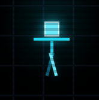

# GLITCH_RUNNER

<div align="center">
  
  <h1>GLITCH_RUNNER</h1>
  <p><em>A cyberpunk platformer where you hack the game world itself</em></p>
</div>

## 🎮 About

GLITCH_RUNNER is a unique platformer game where you don't just control a character—you **hack the game world**. Manipulate physics, visibility, solidity, and behavior of objects in real-time to solve puzzles and reach the exit. Experience the thrill of breaking the rules in a retro-futuristic cyberpunk environment.

## ✨ Features

- **10 Challenging Levels** - From basic property manipulation to complex physics hacks
- **Real-time Object Hacking** - Modify walls, doors, platforms, and enemies on the fly
- **Dynamic Physics Engine** - Gravity, friction, and collision systems you can control
- **Built-in Level Editor** - Create and test your own levels
- **Retro Terminal Aesthetic** - Cyberpunk UI with CRT monitor effects
- **Procedural Audio Synthesis** - Pure code-generated soundtracks and SFX
- **Responsive Controls** - Keyboard and mouse support

## 🚀 Quick Start

### Prerequisites
- Node.js (v16 or higher)
- Modern web browser with Web Audio API support

### Installation

1. **Clone the repository**
   ```bash
   git clone https://github.com/Moeez404/glitch-runner.git
   cd glitch-runner
   ```

2. **Install dependencies**
   ```bash
   npm install
   ```

3. **Start the development server**
   ```bash
   npm run dev
   ```

4. **Open your browser**
   Navigate to `http://localhost:3000` (or the port shown in terminal)

## 🎯 How to Play

### Basic Controls
- **Arrow / SPACE Keys** - Move and jump
- **Mouse Click** - Select and hack objects
- **Inspector Panel** - Modify selected object properties

### Game Mechanics

1. **Movement**: Use arrow keys to move your cyan player character
2. **Object Selection**: Click on any game object to select it
3. **Property Hacking**: Use the inspector panel to modify object properties:
   - **isVisible**: Make objects invisible
   - **isSolid**: Pass through walls and platforms
   - **isStatic**: Make moving platforms stop
   - **gravityScale**: Reverse gravity or make objects float
   - **isDeadly**: Turn enemies into allies
4. **Level Progression**: Reach the exit (usually behind locked doors) to advance

### Level Editor

Access the level editor from the main menu:
- **LEVEL_EDITOR**: Create custom levels
- Drag and drop entities from the palette
- Modify properties in real-time
- Test your levels before saving
- Export levels as JSON

## 🛠️ Development

### Project Structure
```
glitch-runner/
├── src/
│   ├── components/          # React components
│   │   ├── GameViewport.tsx # Main game canvas
│   │   ├── Inspector.tsx    # Property editor
│   │   └── EditorPalette.tsx # Entity creation tools
│   ├── App.tsx             # Main application
│   ├── levels.ts           # Game level definitions
│   ├── types.ts            # TypeScript interfaces
│   ├── constants.ts        # Game constants
│   └── index.tsx           # Entry point
├── public/
│   └── favicon.png         # Game favicon
├── package.json
└── README.md
```

### Build Commands
```bash
# Development server
npm run dev

# Production build
npm run build

# Preview production build
npm run preview
```

### Technologies Used
- **React 19** - UI framework
- **TypeScript** - Type safety
- **Vite** - Build tool and dev server
- **Tailwind CSS** - Styling
- **Web Audio API** - Procedural audio synthesis
- **Canvas API** - 2D rendering

## 🎵 Audio

The game features a unique audio system:
- **Menu Music**: Atmospheric arpeggio loops
- **Game Music**: Driving bass sequences
- **Sound Effects**: All procedurally generated using oscillators
- Audio initializes on first user interaction (browser autoplay policy)

## 🎨 Art Style

- **Color Palette**: Cyberpunk cyan (#00f0ff) on dark backgrounds
- **Typography**: Fira Code monospace font
- **Effects**: CRT scanlines, flicker animations, glow effects
- **UI**: Terminal-inspired interface with retro computing aesthetics

## 🤝 Contributing

1. Fork the repository
2. Create a feature branch (`git checkout -b feature/amazing-feature`)
3. Commit your changes (`git commit -m 'Add amazing feature'`)
4. Push to the branch (`git push origin feature/amazing-feature`)
5. Open a Pull Request

### Adding New Levels

Levels are defined in `levels.ts`. Each level includes:
- Starting position
- Physics settings
- Entity array with positions and properties
- Descriptive text and hints

### Custom Entities

The game supports various entity types:
- **PLAYER**: The controllable character
- **WALL**: Solid obstacles
- **DOOR**: Lockable passages
- **PLATFORM**: Moving/floating surfaces
- **ENEMY**: AI-controlled threats
- **PROJECTILE**: Bullets and hazards
- **EXIT**: Level completion trigger
- **TEXT**: Informational displays

## 📄 License

This project is open source. Feel free to use, modify, and distribute.

## 🙏 Acknowledgments

- Built with React and modern web technologies
- Inspired by classic platformers and cyberpunk aesthetics
- Special thanks to the open source community

---

<div align="center">
  <p><strong>Ready to glitch the matrix?</strong></p>
  <p>Execute your first level and start hacking! 🔧⚡</p>
</div>
